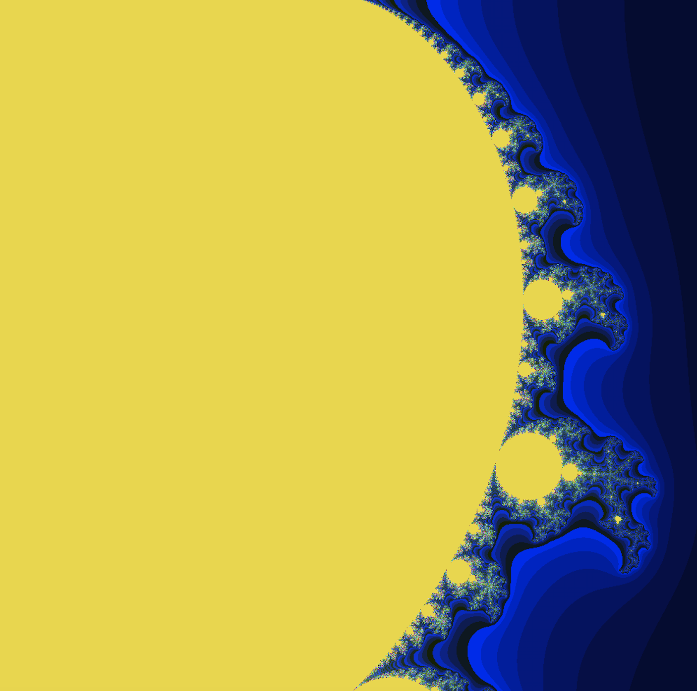
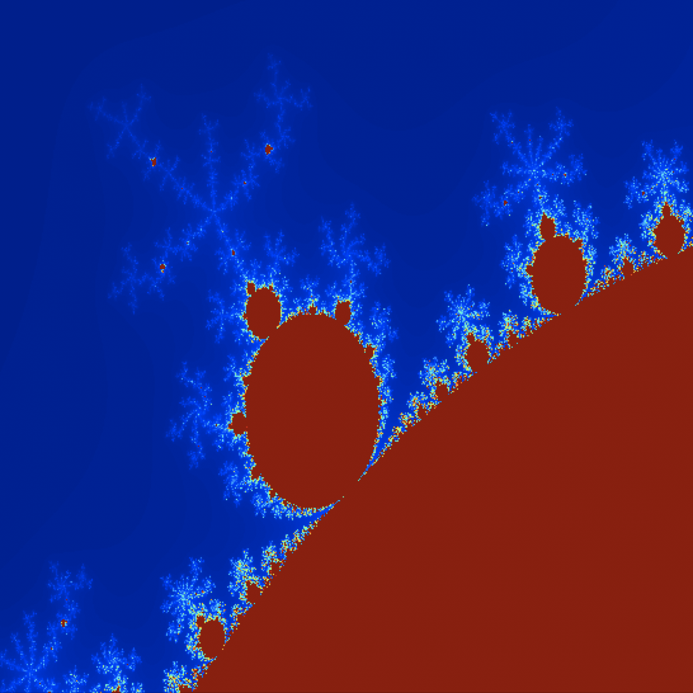

# Mandelbrot Set
#### *Perhaps the most fascinating thing about the mandelbrot set is that no one invented such behaviour, it is woven into the very fabric of nature. Simply expressed by the eternal, beautiful language of mathematics.*

